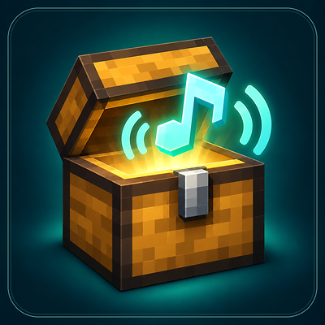

# Chest Chimes

### A little personality in every lid.

**Custom chest-opening sounds. Shared with friends, or just for you.**

Minecraft **1.20.1** · **Forge 47.4.0+ (47.x)** · **Java 17**

[Русское описание](README.ru.md) · [Public Russian guide](https://gist.github.com/Magersers/f215795505dce27ca765382e34bf5093) · [Downloads](https://github.com/Magersers/Chest_Chimes_mod/releases)

---

Turn a chest into a tiny musical moment. A soft chime for your storage room, a dramatic sting for your valuables, or a silly sound that makes your friends smile — choose a clip, save it, and open the lid.

Chest Chimes adds a **♫ button right inside the chest screen**. No resource pack editing or commands needed.

## One chest. Your sound.

**Shared sound** — Set a sound that nearby players can hear. The recording stays with the chest in the world. Anyone who can open the chest can preview and change its shared sound.

**Only me** — Give the same chest your own personal sound. It stays on your computer and is never uploaded to the server. You hear your choice even when someone else opens the chest.

**Personal → Shared → Vanilla** — Your personal sound takes priority. Without one, you hear the shared sound; without either, you hear Minecraft's original opening sound. A personal sound at 0% intentionally silences opening for you.

## Small details, big charm

- **Bring your own audio:** WAV PCM, OGG Vorbis or MP3. The MP3 decoder is included.
- **Keep it short:** choose a 0.1–5 second clip from an input file up to 10 MB.
- **Make it fit:** separate 0–100% volume controls, trimming and instant preview.
- **Hear it nearby:** positional audio fades with distance, within 16 blocks.
- **Keep the familiar close:** the opening melody stops when the lid closes, leaving Minecraft's original closing sound intact.
- **Use your favorite chest:** regular, double, trapped and ender chests.
- **Feel at home:** English and Russian menus.

## From file to first chime

1. Install Minecraft 1.20.1, Forge 47.4.0+ (47.x) and Java 17.
2. Put the Chest Chimes JAR in the mods folder. Remove any older Chest Chimes JAR first.
3. For multiplayer, install the same version on **the server and every player's client**.
4. Open a chest, click **♫**, choose **Shared sound** or **Only me**, then select a file.
5. Preview your clip, adjust its length and volume, and click **Save**. Close and reopen the chest to hear it.

## Good to know

Sounds survive restarts. Shared sounds are saved with the world; personal sounds live in config/chestchimes/local/. You no longer need the original audio file after saving.

A replacement chest gets a new identity and does not inherit its old sound settings. When several players view a chest, it closes when the last viewer leaves. Melody volume does not change vanilla closing volume.

This release targets Forge 1.20.1. Barrels, chest minecarts and third-party containers are not supported.

## License and credits

**Made by Magersers · MIT license · Modpack-friendly**

Chest Chimes code is licensed under [MIT](LICENSE). Keep the copyright and license notice when redistributing. Bundled dependencies retain their own licenses; see [third-party notices](THIRD_PARTY_NOTICES.md). JLayer remains LGPL-2.1-or-later.

## Building

Use JDK 17 and the included Gradle wrapper. Run ./gradlew build (gradlew.bat on Windows). The distributable is build/libs/chest-chimes-1.1.2-all.jar.

Run ./gradlew test for audio/storage unit tests and ./gradlew runGameTestServer for server integration tests. See [manual test scenarios](docs/TESTING.md) for GUI and playback checks.
